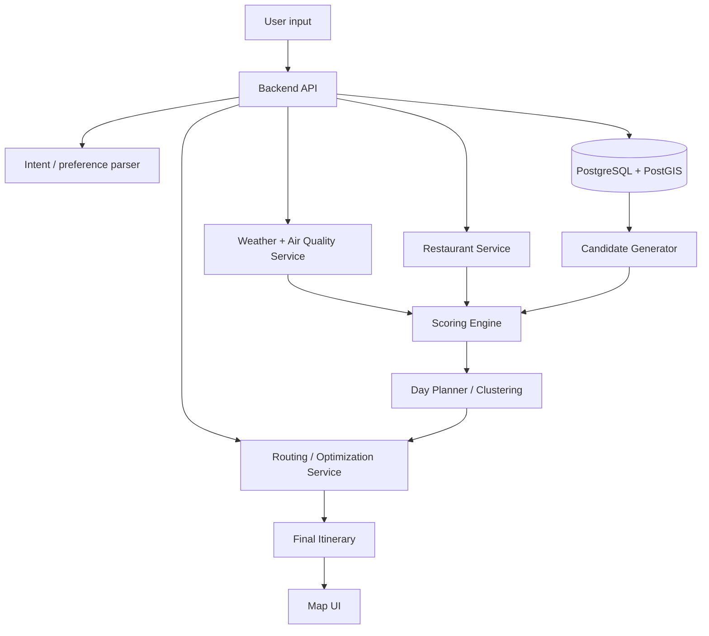

# Vietnam Heritage Travel Recommendation System — Architecture Spec (LLM-readable)

> Purpose of this document: a precise, unambiguous technical spec of the system's architecture and approach, written so an LLM (e.g. for code generation, RAG context, or agent planning) can parse and act on it without needing the original Vietnamese version. Prefer this file as the canonical machine-readable reference.

---

## 1. System summary

A travel-itinerary recommendation system for Vietnamese cultural heritage sites. Given a user's trip constraints (area, dates, group, interests, budget, accessibility needs), the system:

1. Selects relevant heritage sites and restaurants.
2. Scores each candidate using interest match, historical importance, popularity, weather suitability, distance, accessibility, and budget fit.
3. Splits selected sites into day-clusters.
4. Optimizes visiting order per day (TSP/VRP with time windows).
5. Inserts meals (restaurants) at appropriate times.
6. Returns a day-by-day itinerary with explanations, map route, and weather warnings.

Core capability domains: Recommendation System, GIS/Geospatial, Route Optimization (VRP/TSP), Weather/Air-Quality integration, Backend API, optional LLM-based NLU and explanation generation.

---

## 2. Domain entities (canonical schema)

Use these field names consistently across all generated code.

### 2.1 `HeritageSite`

```json
{
  "id": "string",
  "name": "string",
  "province": "string",
  "lat": "float",
  "lng": "float",
  "categories": ["history", "architecture", "unesco", "spiritual", "craft_village", "museum"],
  "description": "string",
  "opening_hours": "string (HH:MM-HH:MM)",
  "estimated_visit_minutes": "int",
  "indoor_score": "float [0,1]",
  "outdoor_score": "float [0,1]",
  "suitable_for_children": "bool",
  "suitable_for_elderly": "bool",
  "ticket_price": "int (VND)",
  "popularity_score": "float [0,1]",
  "historical_importance_score": "float [0,1]"
}
```

### 2.2 `Restaurant`

```json
{
  "id": "string",
  "name": "string",
  "lat": "float",
  "lng": "float",
  "province": "string",
  "specialty_tags": ["string"],
  "rating": "float [0,5]",
  "review_count": "int",
  "price_level": "int [1,4]",
  "opening_hours": "string",
  "source": "google_places | osm | manual",
  "distance_to_nearest_heritage_m": "float"
}
```

### 2.3 `TripRequest` (normalized user input)

```json
{
  "destination_area": "string",
  "start_date": "ISO date",
  "end_date": "ISO date",
  "duration_days": "int",
  "number_of_people": "int",
  "interests": ["history", "architecture", "spiritual", "craft_village", "museum", "local_food", "nature", "photography"],
  "pace": "relaxed | moderate | packed",
  "travel_mode": "walking | motorbike | car | bus | train | mixed",
  "budget_level": "low | medium | high",
  "constraints": ["elderly_friendly", "child_friendly", "avoid_long_walking", "avoid_sun", "prefer_indoor", "prefer_outdoor"],
  "must_visit_site_ids": ["string"],
  "start_location": {"lat": "float", "lng": "float"}
}
```

### 2.4 `Itinerary` (output)

```json
{
  "itinerary_id": "string",
  "summary": "string",
  "total_score": "float [0,1]",
  "total_distance_km": "float",
  "days": [
    {
      "day": "int",
      "date": "ISO date",
      "items": [
        {
          "time": "HH:MM-HH:MM",
          "type": "heritage | restaurant | break | hotel | transit",
          "ref_id": "string",
          "name": "string",
          "reason": "string (human-readable explanation)",
          "travel_from_previous_minutes": "int",
          "distance_from_previous_m": "float"
        }
      ]
    }
  ]
}
```

**Rule for any LLM generating code against this spec:** always use these exact field names and types. Do not invent alternate naming conventions (e.g. `siteId` vs `ref_id`) within the same codebase.

---

## 3. Architecture overview



### 3.1 Component responsibilities

| Component | Responsibility | Suggested tech |
|---|---|---|
| Backend API | Orchestrates the pipeline, exposes REST endpoints | NestJS or Go |
| NLU / Parser | Converts free-text trip requests into `TripRequest` JSON | Rule-based parser, or LLM function-calling for free text |
| PostgreSQL + PostGIS | Stores sites, restaurants, geospatial queries | `ST_DWithin`, `ST_Distance`, GiST index on `geom` |
| Redis | Caches weather results, distance/duration matrices, restaurant lookups | TTL varies by data type (see §7) |
| Weather/AQ Service | Fetches forecast + air quality per coordinate | Open-Meteo (free), Google Air Quality, OpenWeather |
| Restaurant Service | Finds and scores nearby restaurants per meal slot | Google Places API or OSM POIs |
| Routing/Optimization Service | Computes distance/duration matrix and solves ordering (TSP/VRP) | OSRM/Valhalla for matrix; OR-Tools or VROOM for solving |
| Job Queue | Runs heavy itinerary computation asynchronously | BullMQ or RabbitMQ |
| Frontend Map UI | Renders itinerary + route on a map | React + MapLibre GL JS |

---

## 4. Processing pipeline (sequential steps)

Each step is a discrete function. An LLM implementing this should create one module/function per step, matching these signatures conceptually.

### Step 1 — Normalize input
`parseTripRequest(rawInput) -> TripRequest`
Converts free-text or form input into the `TripRequest` schema (§2.3). Use rule-based parsing for structured forms; use an LLM call with function-calling/JSON mode for free-text input.

### Step 2 — Generate candidates
`generateCandidates(tripRequest) -> HeritageSite[]`
- Filter by `province`/area and radius (PostGIS `ST_DWithin`).
- Force-include `must_visit_site_ids`.
- Filter by opening hours against `start_date`–`end_date`.
- Filter by group constraints (`elderly_friendly`, `child_friendly`, etc.).
- Rank by interest tag overlap.
- Return top N (default: 30).

### Step 3 — Fetch weather/environment per candidate
For each candidate site, fetch hourly forecast + air quality for the relevant date/time window. Used as input to Step 4's `weather_suitability_score`.

### Step 4 — Score each site
`scoreSite(site, tripRequest, forecast) -> float [0,1]`

```text
site_score =
    0.30 * interest_match_score +
    0.20 * historical_importance_score +
    0.15 * weather_suitability_score +
    0.15 * distance_score +
    0.10 * popularity_score +
    0.05 * accessibility_score +
    0.05 * budget_score
```

`interest_match_score = |site.categories ∩ user.interests| / |user.interests|`

### Step 5 — Split into day-clusters
`splitIntoDays(scoredSites, numberOfDays, pace) -> DayCluster[]`
- Default: geographic clustering (k-means or DBSCAN, k = numberOfDays).
- Each cluster's item count bounded by `pace` (relaxed: 3 items/day, moderate: 4-5, packed: 6+).
- Total time per day (visit + travel) ≤ 8-10 hours.

### Step 6 — Optimize visiting order per day
`optimizeRoute(dayCluster, distanceMatrix, constraints) -> orderedRoute`
- MVP solver: Nearest Neighbor, then 2-opt improvement.
- Production solver: OR-Tools Routing or VROOM, modeling it as **VRPTW** (Vehicle Routing Problem with Time Windows) with constraints:
  - per-site opening hours,
  - per-site visit duration,
  - meal time windows,
  - max daily duration,
  - mandatory sites,
  - optional "drop visit" if infeasible.

### Step 7 — Insert restaurants
For each day, for each meal slot (breakfast 07:00-09:00, lunch 11:00-13:30, dinner 18:00-20:30):
- Query restaurants near the current route point, matching `specialty_tags`, open at meal time.
- Score with:

```text
restaurant_score =
    0.30 * specialty_match_score +
    0.25 * bayesian_rating_score +
    0.20 * distance_score +
    0.15 * opening_hour_score +
    0.10 * price_fit_score
```

- `bayesian_rating = (v/(v+m))*R + (m/(v+m))*C` where `R` = site's avg rating, `v` = its review count, `C` = area average rating, `m` = minimum review threshold for confidence (avoids high-rating-low-review bias).

### Step 8 — Assemble and return `Itinerary`
Combine ordered sites + inserted restaurants + per-item `reason` strings into the final JSON (§2.4).

---

## 5. Weather suitability rule set

Apply per site per scheduled time slot:

```text
weather_suitability = 1.0
if rain_probability > 70% and site.outdoor_score > 0.6:
    weather_suitability -= 0.35
if temperature > 35°C and site.outdoor_score > 0.6:
    weather_suitability -= 0.25
if uv_index > 8 and visit_time in 11:00-14:00:
    weather_suitability -= 0.20
if pm2_5_level == "unhealthy" and site.outdoor_score > 0.6:
    weather_suitability -= 0.20
clamp(weather_suitability, 0, 1)
```

Action on low score: do not delete the site — instead, reschedule (move outdoor sites to morning, move indoor/museum sites to midday heat or rain windows, or move to a different day if forecast improves).

---

## 6. Quality scoring formula (for ranking full itineraries)

```text
itinerary_score =
    0.25 * average_site_score +
    0.20 * route_efficiency_score +
    0.15 * weather_fit_score +
    0.15 * user_preference_fit_score +
    0.10 * food_experience_score +
    0.10 * schedule_balance_score +
    0.05 * budget_fit_score
```

Use this to A/B-test alternative itineraries for the same request, or to log quality for evaluation.

---

## 7. Optimization guidance (apply when implementing)

| Layer | Optimization |
|---|---|
| Database | GiST/SP-GiST index on `geom` columns; avoid full scans on `ST_DWithin`/`ST_Distance`. |
| Caching | Cache `generateCandidates()` output keyed by `(area, interests_hash, date)`. Cache distance/duration matrices per area (they barely change). TTL: weather 1-3h, opening hours 24h, site metadata several days. |
| Weather calls | Batch by representative grid points per area instead of per-site calls. |
| Routing | Separate "compute distance matrix" (expensive, cacheable) from "solve ordering" (cheap once matrix exists). For ≤12-15 points/day, exact Held-Karp DP is feasible; for time-window constraints, use VROOM or OR-Tools instead of hand-rolled 2-opt. |
| Cost | Default to free sources (Open-Meteo, OSM/Overpass); reserve paid APIs (Google Places/Routes) for cases needing high-accuracy ratings/hours. |
| Reliability | If the routing solver times out (e.g. >3-5s), fall back to Nearest Neighbor immediately and refine asynchronously. Stream itinerary results day-by-day rather than waiting for the full multi-day result. |
| Scoring | Make weight vectors in §4 (Step 4) and §6 configurable at runtime (not hardcoded) to allow A/B testing. Version the scoring formula so historical itineraries remain interpretable after weight changes. |

---

## 8. Reusable open-source building blocks

Use these instead of writing solvers/engines from scratch:

| Need | Library/Repo | Notes |
|---|---|---|
| TSP/VRP solver with time windows | `VROOM-Project/vroom` (C++) / `VROOM-Project/pyvroom` (Python binding) | Solves Step 6's VRPTW in milliseconds; preferred over hand-written 2-opt for production. |
| TSP/VRP solver, constraint-rich | Google OR-Tools (`ortools` Python package) | Use when constraints get complex (multiple time windows, capacity, dropped visits). |
| Distance/duration matrix (self-hosted) | `Project-OSRM/osrm-backend` | Feed its matrix output into VROOM/OR-Tools. |
| Distance/duration matrix + isochrones | `valhalla/valhalla` | Use if accessibility scoring needs "reachable within N minutes" logic. |
| Multi-modal public transit planning (future extension) | `opentripplanner/OpenTripPlanner` | Only needed if scope expands to bus/transit routing. |
| Architecture reference for self-hosted trip planners | `mauriceboe/TREK`, `itskovacs/trip` | Read for data modeling and weather+route integration patterns; do not fork wholesale. |
| Heritage/POI seed data | OpenStreetMap Overpass API (tags `historic=*`, `tourism=*`) | Use to bootstrap initial dataset; verify license before reuse from crawled GitHub datasets. |

---

## 9. Implementation notes for code-generation tasks

When asked to implement any part of this system:

1. Always conform to the entity schemas in §2 — do not rename fields.
2. Implement pipeline steps as independently testable functions matching §4's step boundaries.
3. Default to the MVP algorithm path (rule-based scoring + Nearest Neighbor + 2-opt) unless explicitly asked for the production path (VROOM/OR-Tools with time windows).
4. Respect the weather rule set in §5 exactly as specified, including the rescheduling behavior (never silently drop a site for weather reasons alone).
5. Treat money fields as VND integers, coordinates as WGS84 `lat`/`lng` floats, and time-of-day as 24h `HH:MM` strings unless told otherwise.
6. Do not call paid APIs (Google Places/Routes) in generated code by default — use Open-Meteo/OSM equivalents unless the task explicitly requires Google's API.
